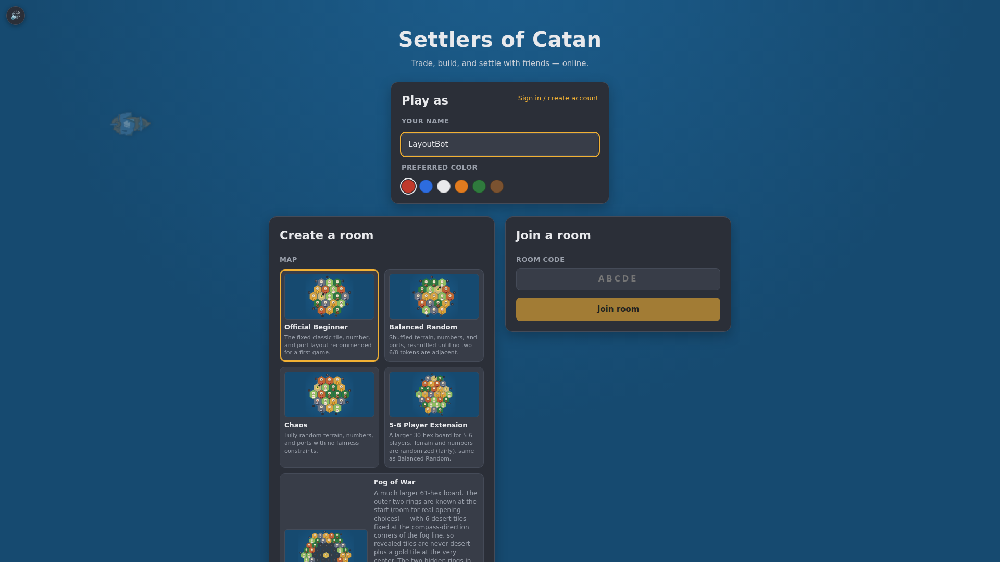
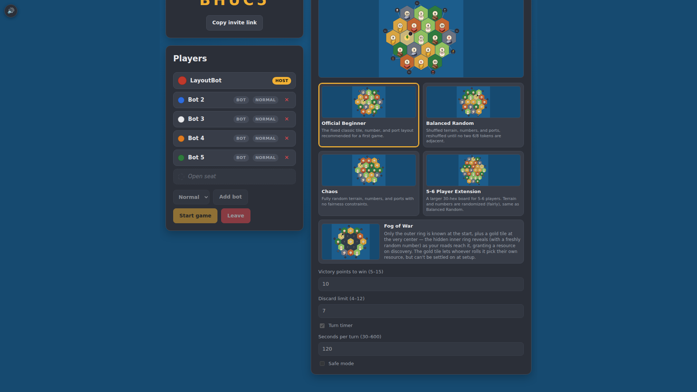
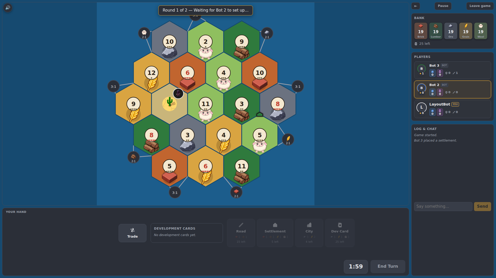
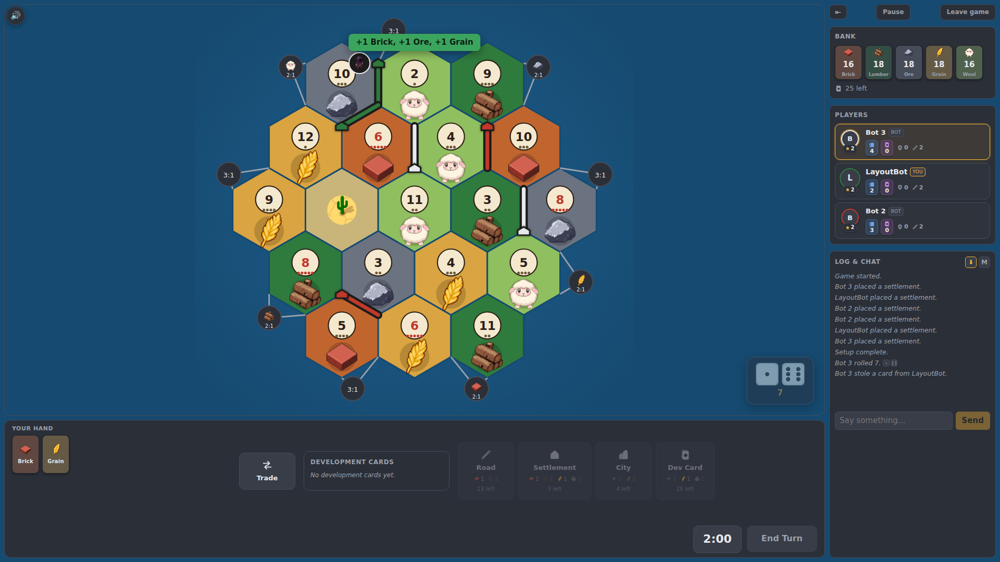

# Screenshots

Captured by `web/e2e/layout.spec.ts` (Playwright) against the `desktop-1080p` project
(1920x1080). Regenerated automatically by the `capture-screenshots` job in
[`.github/workflows/deploy.yml`](.github/workflows/deploy.yml) on every push to `main`, so
these always reflect what's currently live at
[mikeadair-catan.web.app](https://mikeadair-catan.web.app).

## Home

Sign in, pick a name and color, create a room, or join one by code.

## Lobby

Seats, invite link, host controls (add bots, start game), and the game settings panel
(map, victory points, discard limit, turn timer, safe mode).

## Game setup

Initial placement phase — each player places their starting settlements and roads.

## Mid-game

An in-progress game: the board, dice, resource hand, trade panel, and game log.

